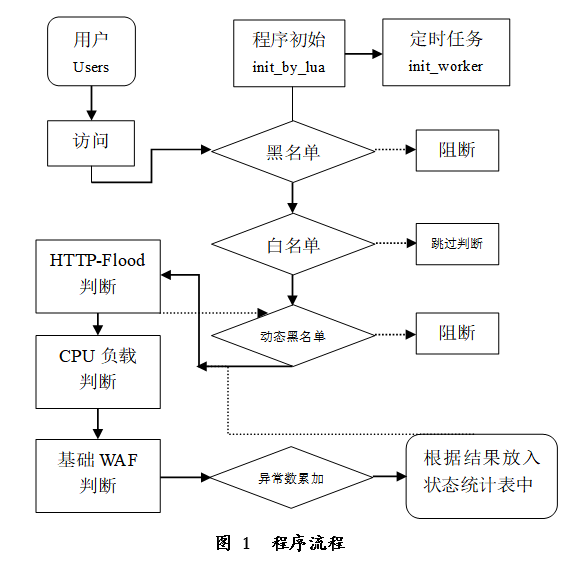

_* 侧重点在于根据客户访问的历史情况来判断威胁_

> lua_waf概念来自https://github.com/loveshell/ngx_lua_waf

## 设计依据
> 引用自《面向小型站点的低成本WEB安全防护系统设计与实现》
```
3 过程论述
3.1  解决的关键问题
根据方案论述中的小型站点面临的问题，本设计将着重解决以下几个问题：
3.1.1  HTTP-Flood
针对该种攻击的防御关键是如何将正常的HTTP行为区分开来。
HTTP-Flood攻击是一种攻击方式简单，但对业务影响大的攻击方式。HTTP-Flood攻击在应用层发起，它会模拟正常用户的正常请求行为，与之不同的是请求数较多、资源消耗较大。
（1）从攻击来源来看要考虑两种情况
① 大量用户使用的是NAT网络，只是在该NAT网络中的一个用户进行了恶意攻击，如何在不影响其它用户正常访问的情况下，将该恶意用户封禁掉；
② 有大量新的独立IP进行访问，但单个IP访问较少，又如何识别这其中的异常请求。
（2）从攻击特征的异常情况来看
① 只进行请求，忽略响应的数据，发送完后，不进行接收操作，直接断开连接；
② 持续不断地请求相同的URL路径，但参数有可能变化；
③ 该行为的QPS每秒请求数相对于其它正常的请求较高；
④ 对服务器响应的Javascript脚本代码内容的运行能力较弱。
本设计将针对以上特点进行HTTP-Flood的识别和阻断。
3.1.2  基础WAF防护能力
WAF通过检查客户端发来的请求流量，侦测请求中是否存在危险的可能被当成命令执行的字符串，和是否存在可能的备份文件、敏感信息等文件或路径名，如果存在，将对该请求进行风险标识。
利用ngx_lua中高效的正则匹配能力来进行规则匹配，规则有以下几个类别：
（1）SQL注入
对于SQL注入，为了尽量避免对正常服务造成的误报，将对GET的动态请求参数、POST表单模式提交的数据进行分步判断，先判断是否存在危险的可能被当作命令执行的字符串，在判断是否存在分割标识符。
（2）XSS攻击
对于XSS攻击，同样会对于GET的查询参数和POST的参数进行判断。
（3）敏感目录/文件泄漏/目录遍历
对于敏感目录/目录的防护，主要在于GET的查询参数和URL中的PATH值。
```

## 流程图
程序流程



数据统计流程


阀值判断流程


## 部署说明
> 引用自《面向小型站点的低成本WEB安全防护系统设计与实现》
```
4  部署过程
4.1  程序结构
程序的文件目录结构如下：
.
├── config.lua
├── init.lua
├── init_worker.lua
├── log.lua
└── waf.lua
config.lua为配置文件，其中预置的全局的私钥，白名单、黑名单和三个Deny类型的默认阀值，一些判断流程的默认开关值。
init.lua为init_by_lua阶段执行的文件，包含有整个程序的全局公用函数、全局公用变量等。
init_worker.lua为init_worker_by_lua阶段执行的文件，功能有计算cpu核心数、定期释放全局变量的缓存和定期计数cpu的负载等操作。
log.lua为log_by_lua阶段执行的文件，在一个请求结束后，会调用该文件的函数，将本次的响应情况记录到全局的统计表中。
waf.lua为access_by_lua阶段执行的文件，这是执行截断请求、判断参数安全和三个Deny类型具体执行动作的关键阶段文件。

4.2  程序部署
程序是基于nginx_lua_module模块的开发，为了方便使用该模块，推荐直接使用集成好Lua和Luajit的基于Nginx开发的Openresty开源服务器。
Openresty程序默认安装后nginx配置文件路径为/usr/local/openresty/nginx/conf，假设我将waf程序放置到/usr/local/openresty/nginx/conf/waf文件夹下。
部署步骤：

（1）在nginx.conf配置中的http阶段需要添加
#该命令用来定义lua程序require时的路径信息：
lua_package_path "/usr/local/openresty/nginx/conf/waf/?.lua;;";

#定义程序使用的全局信息缓存空间：
lua_shared_dict dict_sid 20m;
lua_shared_dict dict_ip 15m;
lua_shared_dict dict_deny 10m;
lua_shared_dict dict_sys 1m;

#定义init阶段和init_worker阶段要执行的代码：
init_by_lua_file  /usr/local/openresty/nginx/conf/waf/init.lua;
init_worker_by_lua_file /usr/local/openresty/nginx/conf/waf/init_worker.lua;

（2）根据具体需要，在http、server、location阶段加入以下配置
#定义access阶段和log阶段执行的代码：
access_by_lua_file /usr/local/openresty/nginx/conf/waf/waf.lua;
log_by_lua_file /usr/local/openresty/nginx/conf/waf/log.lua;

说明：
① 如果在http阶段加入，将会是该服务器的全部请求都纳入统计数据、安全判断和阻断；
② 在server下加入，将只对该server下的域名进行防护和统计；
③ 在对应的location下加入，将只对该location下的请求进行统计和阻断；
④ 全局包含部分，不可随意放置，比如再http上放置了，就不能在server下和location下放置，在server下放置了就不能再在location下放置。

（3）如果对不同的位置有不同的阀值需要，可以通过以下指令定义
set Deny1 100	#Deny类型1的总请求数阀值
set Deny2 300	#Deny类型2的总请求数阀值
set Deny3 500	#Deny类型3的总请求数阀值
set disable_sec 0		#用来关闭基本安全检查

（4）部署建议
建议对于静态文件数据可以适当高一点，动态文件路径和静态文件配置不同的namespace，默认namespace为’’：
set namespace 1
这样就可以通过namespace参数定义不同的统计和判断空间，使得资源消耗不同的路径使用不同的阀值和统计空间，这样就更加的灵活了。
```